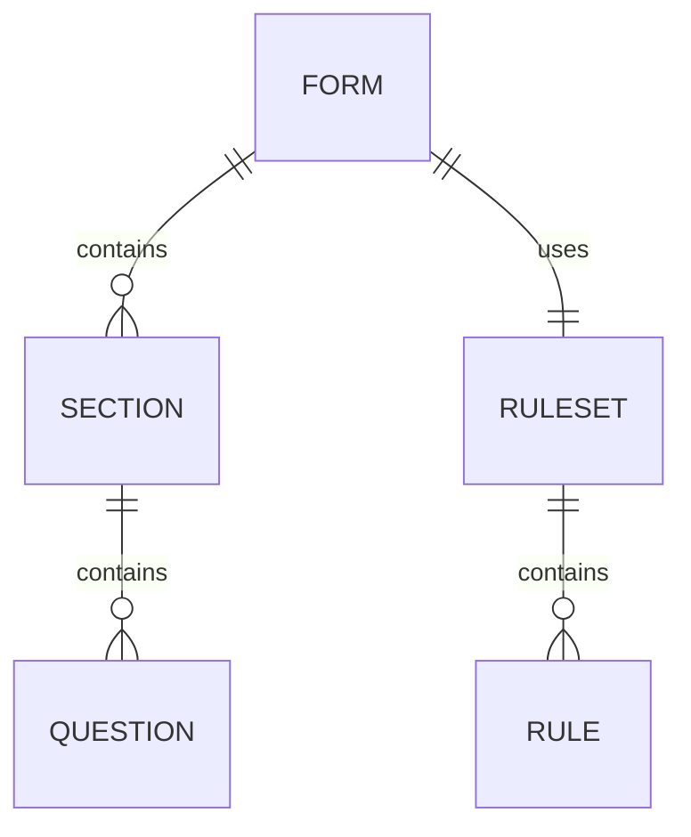

# 📚 Você na Facul — Backend

**Você na Facul** é uma plataforma sem fins lucrativos que visa democratizar o acesso à universidade.  
Além de oferecer uma experiência para estudantes, também fornece ferramentas para **cursinhos parceiros** gerenciarem seu processo seletivo, turmas, frequência, solicitações de documentos e outras funcionalidades.

---

## 🚀 Funcionalidades Principais

- **Gestão de Formulários**
  - Estrutura hierárquica: `Form` → `Section` → `Question`
  - Suporte a diferentes tipos de questões e opções de resposta
  - `helpText` para instruções adicionais

- **Sistema de Regras**
  - `RuleSet` vinculado a um formulário
  - Regras de **pontuação** (`Score`) e **desempate** (`TieBreaker`)
  - Estratégia **PerOption**: define pontuação por opção escolhida
  - Validação automática de estrutura via `ConfigSchemaValidationPipe`
  - Validação no serviço para garantir que opções existam na questão

- **Ranking de Estudantes**
  - Recebe lista de usuários
  - Calcula pontuação com base no `RuleSet` e respostas
  - Retorna ranking ordenado por pontuação (e critérios de desempate)

---

## 🛠 Tecnologias

- **Node.js** + **NestJS**
- **MongoDB** + **Mongoose**
- **Swagger** para documentação e testes de API
- **Class-Validator** e **Class-Transformer** para validação e transformação
- **Docker** (opcional, para desenvolvimento e homologação)

---

## 📂 Estrutura de Entidades



- **Form** → contém `sections` e um `ruleSet`
- **Section** → contém `questions`
- **Question** → contém enunciado, opções e metadados
- **RuleSet** → agrupa `scoringRules` e `tieBreakerRules`
- **Rule** → define estratégia e configuração de pontuação

---

## ⚙️ Como Rodar

### Pré-requisitos

- Node.js 20+
- MongoDB 6+
- (Opcional) Docker + Docker Compose

### Instalação

```bash
# Instalar dependências
npm install

# Rodar em desenvolvimento
npm run start:dev
```

---

## 📑 Documentação da API

A documentação interativa (Swagger) estará disponível em:

```
http://localhost:3000/api
```

---

## 🧪 Testes

```bash
# Testes unitários
npm run test

# Testes e2e
npm run test:e2e
```

---

## 📌 Próximos Passos

- Implementar autenticação/autorização para endpoints sensíveis
- Melhorar regras de desempate no ranking
- Adicionar cache para cálculos de ranking
- Criar exportação de resultados em CSV/PDF
