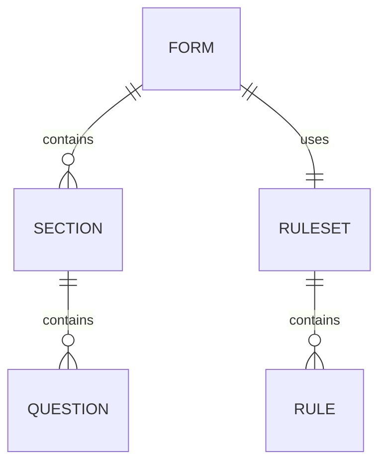

# 📝 Você na Facul — vcnafacul-form

Microsserviço de **construtor de formulários** da plataforma **Você na Facul**.

Permite criar formulários hierárquicos (`Form → Section → Question`), aplicar regras de pontuação/desempate configuráveis e rankear respondentes. É usado principalmente em processos seletivos de cursinhos parceiros. **Não é exposto ao público**: só recebe chamadas do gateway `api-vcnafacul`.

---

## 🧩 Arquitetura

```
client-vcnafacul  →  api-vcnafacul  →  ms-simulado       (motor de provas)
  (React SPA)       (NestJS gateway)   (NestJS + MongoDB)
                         ↓
                    vcnafacul-form    ← você está aqui
                    (NestJS + MongoDB)
```

| Serviço | Stack | Banco | Porta |
|---------|-------|-------|-------|
| api-vcnafacul | NestJS 10 + TypeORM | MySQL 8+ | `3333` |
| ms-simulado | NestJS 10 + Mongoose | MongoDB | `3000` |
| **vcnafacul-form** (este) | NestJS 11 + Mongoose | MongoDB | `3001` |
| client-vcnafacul | React 19 + Vite 6 | — | `5173` |

---

## 🚀 Funcionalidades principais

- **Gestão de formulários** — hierarquia `Form → Section → Question`, tipos variados de questão, `helpText`
- **Sistema de regras** (`RuleSet`) — pontuação (`Score`) e desempate (`TieBreaker`) por estratégia plugável:
  - `PerOption` — pontuação fixa por opção escolhida
  - `InverseProportional` — proporcional ao inverso do valor numérico
  - `ComputedInverseProportional` — combina múltiplas perguntas via expressão matemática
- **Validação dupla** — `ConfigSchemaValidationPipe` (AJV + Zod) no schema das regras + checks de domínio no service
- **Ranking** — recebe lista de usuários, calcula pontuação, retorna ordenado com desempates

---

## 🛠 Tecnologias

- **NestJS 11** (TypeScript)
- **MongoDB** + **Mongoose** (replica set recomendado para transações)
- **Zod** + **AJV** (validação de schema de regras)
- **class-validator** / **class-transformer** (DTOs)
- **mongodb-memory-server** (testes — DB em memória automático quando `NODE_ENV=test`)
- **Swagger** em `/api`
- **MongoExceptionFilter** para erros do driver
- **Jest** (unit + e2e)

---

## 📂 Modelo de entidades


```mermaid
erDiagram
    FORM ||--o{ SECTION : contains
    SECTION ||--o{ QUESTION : contains
    FORM ||--|| RULESET : uses
    RULESET ||--o{ RULE : contains
```

- **Form** → contém `sections` e um `ruleSet`
- **Section** → contém `questions`
- **Question** → enunciado, opções, metadados
- **RuleSet** → agrupa `scoringRules` e `tieBreakerRules`
- **Rule** → estratégia + configuração

---

## ⚙️ Pré-requisitos

- Node.js 20+
- Yarn
- MongoDB 6+ (replica set para transações — ver `docker-mongodb-replica.sh`)

---

## 🚀 Setup

```bash
# Instalar dependências
yarn

# Copiar .env e preencher
cp .env.example .env
# MONGODB, PORT, NODE_ENV

# Subir replica set local (uma vez)
./docker-mongodb-replica.sh

# Rodar em watch (porta 3001)
yarn dev
```

---

## 📑 Documentação da API

Swagger disponível em:

```
http://localhost:3001/api
```

---

## 🧪 Testes

```bash
# Unit (usa mongodb-memory-server automaticamente)
yarn test

# e2e
yarn test:e2e

# Auditoria de dependências customizada
yarn check:deps
```

---

## 🔀 CI/CD

- `ci-homol.yml` — deploy em homologação ao mergear PR em `develop`
- `ci-prod.yml` — deploy em produção ao publicar tag `v*`

---

## 📄 Licença

MIT.
